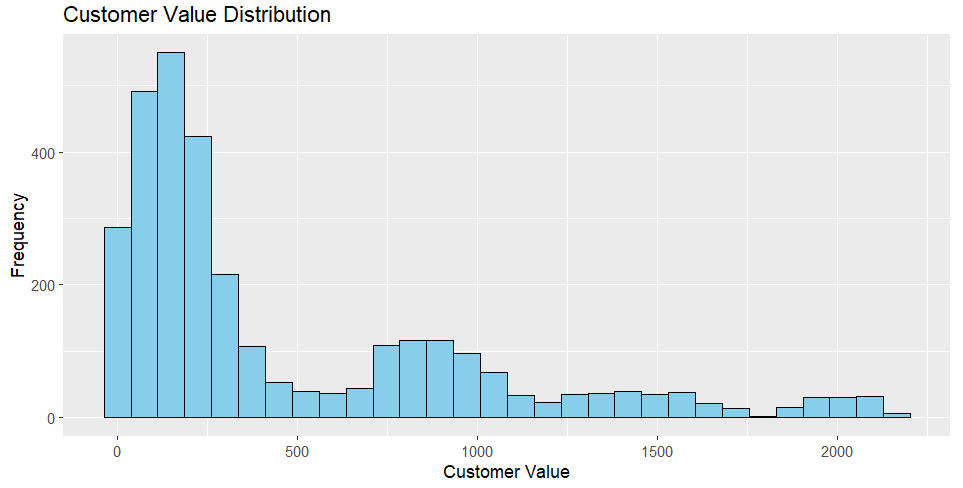
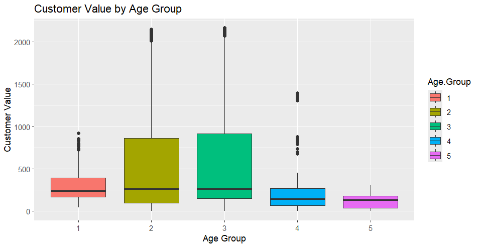
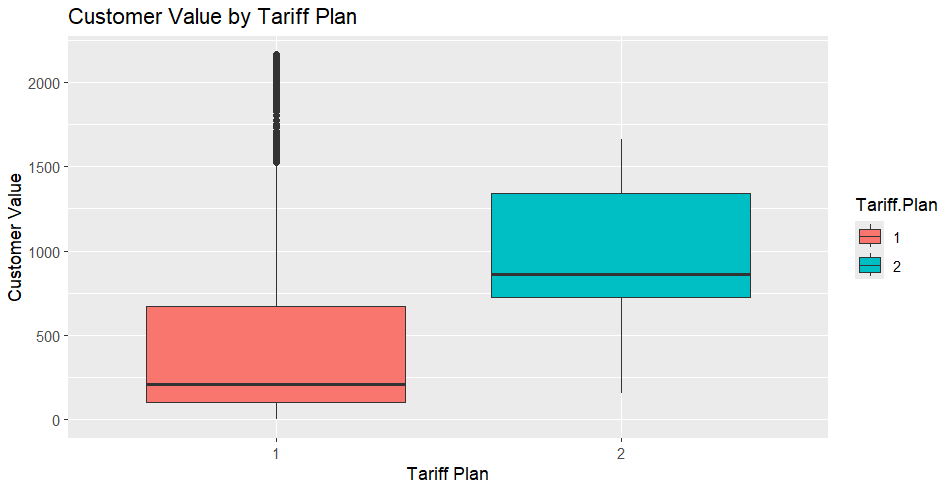
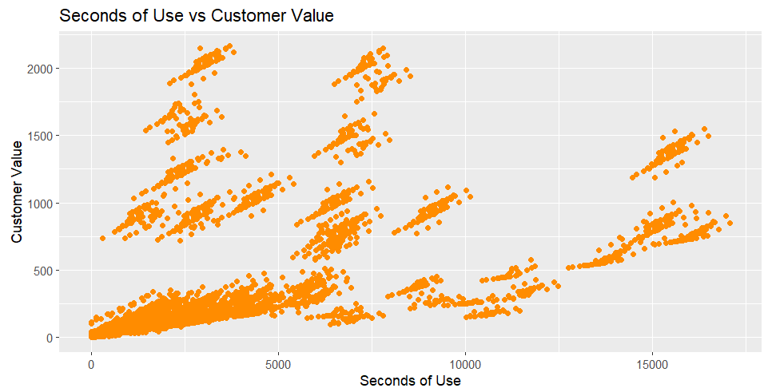

# Customer Churn Analysis and Prediction

## Overview
Customer churn, also known as customer attrition, refers to when a customer stops using a company’s products or services. The churn rate measures the number of customers lost during a specific time period, such as a month, quarter, or year.  

This project focuses on **analyzing customer behavior** and **predicting churn** using machine learning techniques. By leveraging customer demographic, behavioral, and transaction data, the goal is to **identify valuable customers** and implement **targeted retention strategies**.

---

## Features
- **Data Preprocessing**: Cleaning the dataset, handling missing values, and creating meaningful features.  
- **Customer Insights**: Calculating metrics such as **Customer Lifetime Value (CLV)** and customer satisfaction scores.  
- **Churn Prediction**: Implementing machine learning models such as:
  - Logistic Regression
  - Random Forest
  - Gradient Boosting
  - Neural Networks  
- **Visualization**: Creating visual insights and trends using interactive dashboards and plots.  
- **Actionable Recommendations**: Providing data-driven strategies to retain high-value customers.

---

## Exploratory Data Analysis (EDA)
The dataset was explored through various visualizations to understand patterns in customer value, age groups, tariff plans, and usage behavior.

### 1. Customer Value Distribution
This histogram shows how customer value is distributed across the customer base. Most customers fall into lower value ranges, with a few high-value outliers.  

---

### 2. Customer Value by Age Group
This boxplot analyzes how customer value varies across different age groups. Younger age groups show higher variability and outliers, while older groups tend to have lower median values.  

---

### 3. Customer Value by Tariff Plan
This boxplot compares customer values between different tariff plans. Customers on Tariff Plan 2 generally have higher median values and a broader spread, indicating they are more profitable.  

---

### 4. Seconds of Use vs Customer Value
This scatter plot shows the relationship between usage time (seconds) and customer value. There is a positive trend, with higher usage often correlating with higher customer value, but with distinct clusters indicating behavioral segments.  

---

## Machine Learning Models Used
The project applies several supervised learning models to predict customer churn:
- Logistic Regression  
- Random Forest Classifier  
- Gradient Boosting Models  
- Neural Networks (optional, experimental)  

Models were evaluated based on accuracy, precision, recall, F1-score, and ROC-AUC.

---
